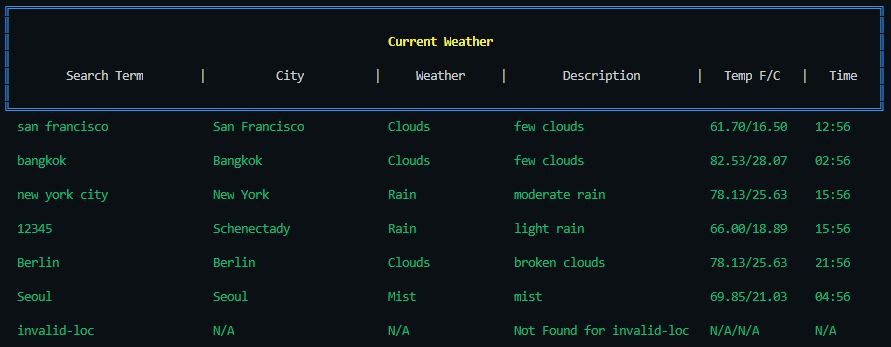

# inv-tech-weather sample app

## Description:

Given an array of inputs (location name, postal code), log the current time and weather for those locations.
Cities or ZipCodes are delimited by commas or spaces, two word cities must be enclosed in single or double quotes.

## Usage:

**Example:**

```
node ./weather 'New York', 10005, Tokyo, 'São Paulo', Pluto
```

**Response:**


## Requirements:

The code should be self-documenting, although you can use comments to convey the reason for your design decisions.

Make sure you commit your progress in a sensible way, if you're doing TDD you should start with tests.

You'll be evaluated on:

- Code consistency and naming conventions

- Use of reactive/functional paradigm

- Code abstraction

- Error Handling

- Testing

- Git commiting
